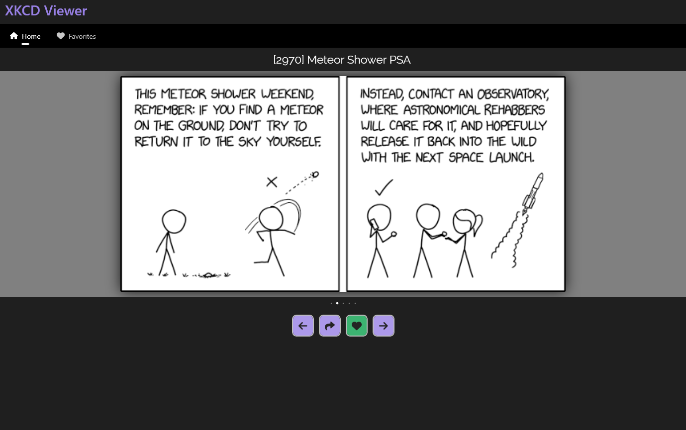
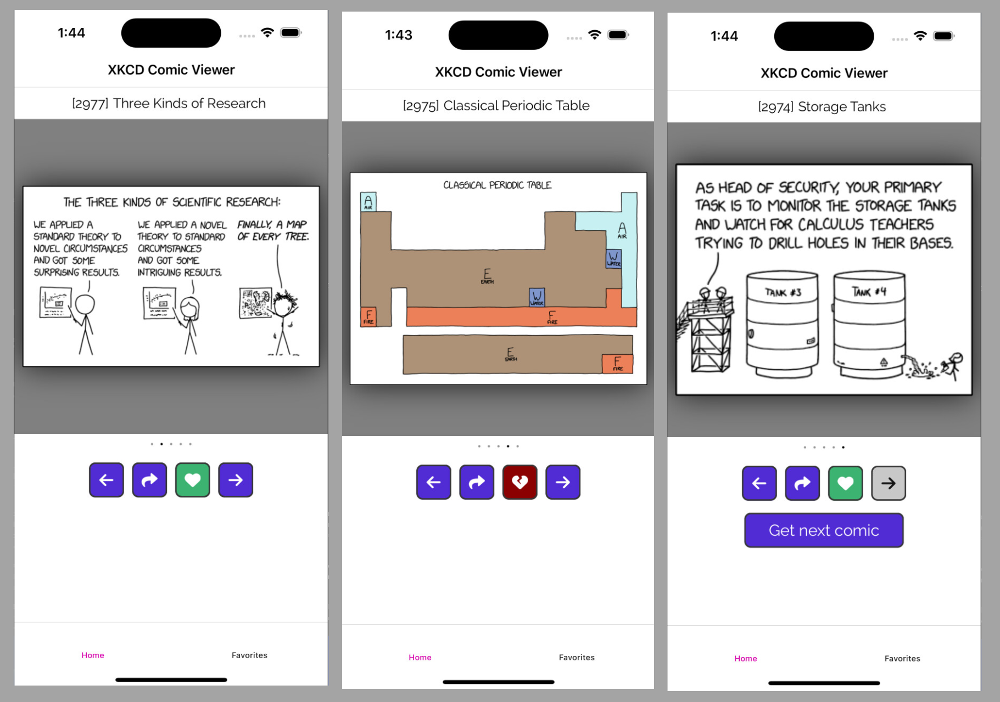
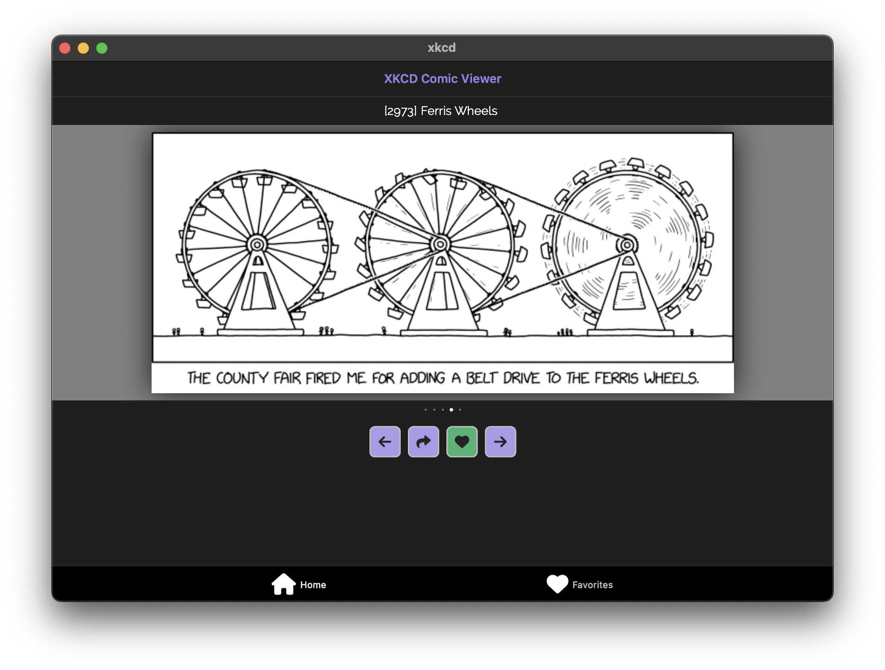

# xkcd Viewer

A .NET MAUI application, built with Telerik UI for Maui, to explore and favorite xkcd comics.

## Build

| Project | `main` | `release` |
|---------|--------|-----------|
| .NET MAUI |  |  |

## Releases

| Type | Location |
|------|----------|
| WinUI | [Microsoft Store](https://apps.microsoft.com/detail/9pmckht7m93p?hl=en-us&gl=US), [Sideload ARM64 & x64](https://github.com/LanceMcCarthy/XkcdViewer/releases) |
| Android | (coming soon) |
| Mac | (coming soon) |
| iOS | (coming soon) |

## App

### Windows

### Android

### iOS

### Mac

